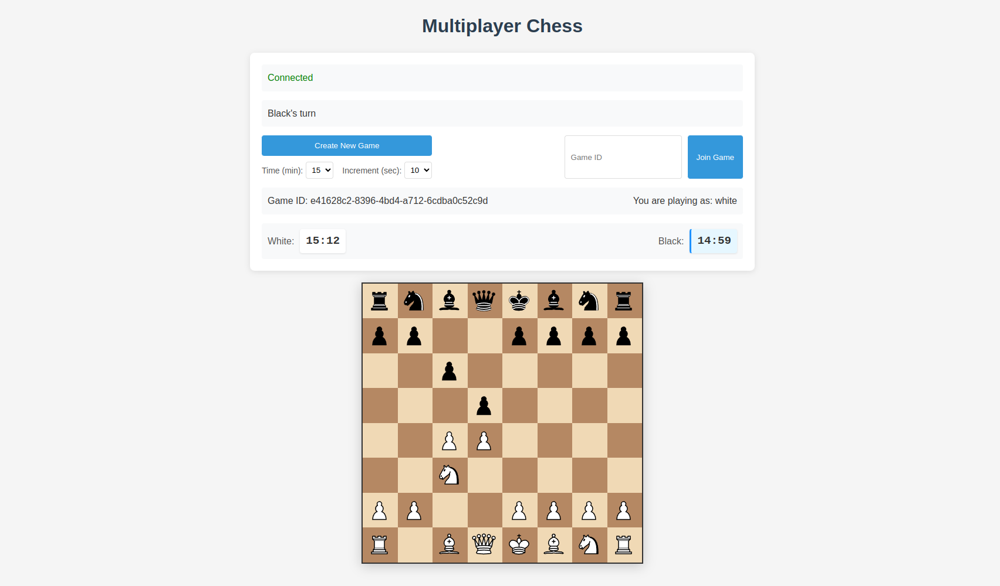

# Multiplayer Chess Web Application

A real-time multiplayer chess game built with Rust (backend) and HTML/JavaScript (frontend), using WebSockets for communication.

 <!-- Add a screenshot here -->

## Features

- Create and join chess games with unique game IDs
- Real-time gameplay with WebSocket communication
- Visual highlighting of selected pieces, valid moves, and last move
- Turn-based gameplay with proper validation
- Game state updates and notifications
- Responsive design for different screen sizes
- Chess clock with configurable time controls and increments
- Pawn promotion dialog
- Game status updates (check, checkmate, stalemate, etc.)
- Automatic detection of insufficient material draws

## Technology Stack

- **Backend**: Rust with Actix Web framework
  - actix-web: Web server framework
  - actix-web-actors: WebSocket support
  - chess: Chess game logic and validation
  - serde: Serialization/deserialization for JSON
  - uuid: Generating unique game IDs

- **Frontend**: HTML, CSS, JavaScript
  - Pure JavaScript (no frameworks)
  - WebSocket API for real-time communication
  - Responsive design with CSS
  - Unicode chess symbols for piece representation

## Architecture

The application follows a client-server architecture:

1. **Server (Rust)**
   - Manages game state and logic using the `chess` crate
   - Handles WebSocket connections for real-time communication
   - Validates moves and updates game state
   - Manages player connections and game rooms
   - Implements chess clock functionality

2. **Client (JavaScript)**
   - Renders the chessboard and pieces
   - Handles user interactions (selecting and moving pieces)
   - Communicates with the server via WebSockets
   - Updates the UI based on game state changes
   - Manages timers and game status display

3. **Communication Protocol**
   - JSON messages over WebSockets
   - FEN (Forsyth-Edwards Notation) for board state representation
   - Client-server message types include: game creation, joining, moves, valid moves requests, and game updates

## Getting Started

### Prerequisites

- Rust and Cargo (https://www.rust-lang.org/tools/install)
- A modern web browser with WebSocket support

### Running the Application

1. Clone the repository:
   ```bash
   git clone https://github.com/yourusername/chess_web_app.git
   cd chess_web_app
   ```

2. Build and run the application:
   ```bash
   cargo run
   ```

3. Open your browser and navigate to `http://localhost:8080`

### Development Setup

For development, you might want to use the following:

1. Enable logging for better debugging:
   ```bash
   RUST_LOG=debug cargo run
   ```

2. For hot-reloading during development, you can use `cargo-watch`:
   ```bash
   cargo install cargo-watch
   cargo watch -x run
   ```

## How to Play

1. **Create a Game**:
   - Click the "Create New Game" button
   - Select your preferred time control and increment
   - Share the generated Game ID with your opponent

2. **Join a Game**:
   - Enter the Game ID in the input field
   - Click the "Join Game" button

3. **Playing**:
   - Click on your piece to select it
   - Valid moves will be highlighted
   - Click on a highlighted square to move your piece
   - The game will automatically validate moves and update the board
   - Chess clock will count down during your turn and add the increment after you move

4. **Game End Conditions**:
   - Checkmate: When a king is in check and cannot escape
   - Stalemate: When a player has no legal moves but is not in check
   - Insufficient material: When neither player has enough pieces to checkmate
   - Time forfeit: When a player's time runs out

## Troubleshooting

- **Connection Issues**: If you encounter issues with WebSocket connections, ensure that your browser supports WebSockets and that no firewall is blocking the connection.
- **Game Not Updating**: If the game board doesn't update after a move, try refreshing the page and rejoining the game.
- **Browser Compatibility**: This application works best in modern browsers (Chrome, Firefox, Edge, Safari).
- **Server-Side Errors**: Check the console output for error messages if you're running the server locally.

## Contribution Guidelines

1. **Fork the Repository**: Start by forking the repository and creating a new branch for your feature or bug fix.
2. **Code Style**: Ensure your code follows the existing coding style and conventions.
3. **Testing**: Write comprehensive tests for new functionality.
4. **Documentation**: Update the documentation to reflect your changes.
5. **Pull Request**: Submit a pull request with a clear description of your changes.

## Project Structure

- `src/main.rs`: Main server code and WebSocket handlers
- `src/models.rs`: Data models for the application
- `static/index.html`: Main HTML page
- `static/css/style.css`: Styling for the application
- `static/js/chess.js`: Chess utility functions
- `static/js/app.js`: Frontend application logic

## Future Enhancements

- Spectator mode for watching games
- Game history and replay functionality
- User accounts and ratings
- Tournament support
- Chat functionality
- Mobile app version

## License

This project is open source and available under the MIT License.

## Acknowledgments

- [chess](https://crates.io/crates/chess) crate for chess logic
- [Actix Web](https://actix.rs/) for the web server framework
- All contributors who have helped improve this project
